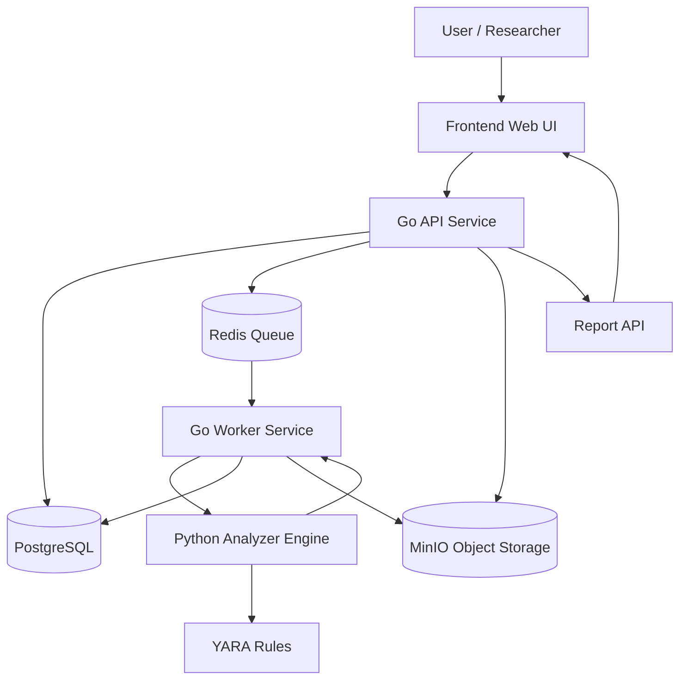

# MALCORE Architecture

MALCORE is designed as a modular malware analysis sandbox with a Go-based backend and Python-based analyzer engine.

The system follows a pipeline architecture:

```text
Upload / URL Submission
        ↓
Validation
        ↓
Quarantine Storage
        ↓
Job Queue
        ↓
Analysis Workers
        ↓
Analyzer Engine
        ↓
Scoring Engine
        ↓
Report Generation
````

---

## High-Level Architecture



---

## Services

### 1. Frontend Web UI

The frontend provides the user interface for MALCORE.

Responsibilities:

* Upload suspicious files
* Submit URLs for analysis
* Provide archive password input
* Show job status
* Display analysis results
* Download reports

The frontend does not analyze files directly. It only communicates with the Go API.

---

### 2. Go API Service

The Go API is the main entry point of the system.

Responsibilities:

* Accept file uploads
* Accept URL submissions
* Validate requests
* Create analysis jobs
* Store metadata in PostgreSQL
* Save files to quarantine storage
* Push analysis jobs to Redis
* Return job status and results

The API must never execute uploaded files.

---

### 3. Go Worker Service

The Go Worker processes background jobs.

Responsibilities:

* Pull jobs from Redis
* Load file metadata
* Call the Python Analyzer Engine
* Collect analyzer output
* Store analysis results
* Update job status
* Trigger report generation

The worker acts as the orchestration layer between the backend system and analyzer modules.

---

### 4. Python Analyzer Engine

The Python Analyzer Engine performs file analysis.

Responsibilities:

* PE analysis for `.exe` and `.dll`
* Script analysis for `.ps1`, `.js`, `.vbs`, `.bat`, `.cmd`
* Office macro analysis for `.docx`, `.xls`, `.ppt`
* Archive analysis for `.zip`, `.rar`, `.7z`
* YARA scanning
* IOC extraction
* Feature extraction for scoring

Python is used here because malware analysis tooling is stronger in the Python ecosystem.

---

### 5. PostgreSQL

PostgreSQL stores structured system data.

Stores:

* analysis jobs
* file metadata
* hashes
* MIME information
* analyzer results
* YARA hits
* IOCs
* risk scores
* report metadata

PostgreSQL is the source of truth for job state and analysis history.

---

### 6. Redis

Redis is used as the job queue backend.

Responsibilities:

* Store queued analysis tasks
* Allow workers to process jobs asynchronously
* Separate user requests from heavy analysis work

This prevents the API from blocking while files are analyzed.

---

### 7. MinIO

MinIO is used as object storage.

Stores:

* uploaded files
* downloaded URL files
* extracted archive artifacts
* generated reports

Files are stored in private buckets and referenced by object keys in PostgreSQL.

---

## Data Flow

### Step 1 — File Upload or URL Submission

The user either uploads a file or submits a URL.

The API receives the request and validates:

* file exists
* file size is allowed
* file extension is supported
* URL is safe
* URL does not point to internal/private IP ranges

---

### Step 2 — Quarantine Storage

The file is stored in quarantine storage.

Rules:

* original filename is stored only as metadata
* actual storage filename is randomly generated
* file is not executed
* path traversal is blocked
* files are stored with restricted permissions

---

### Step 3 — Metadata Extraction

The system calculates basic metadata:

* MD5
* SHA256
* file size
* MIME type
* extension mismatch flag

This metadata is stored in PostgreSQL.

---

### Step 4 — Job Creation

The API creates an analysis job.

Possible job statuses:

* `pending`
* `queued`
* `running`
* `completed`
* `failed`
* `needs_password`

The job is pushed to Redis for background processing.

---

### Step 5 — Worker Processing

The Go Worker picks up the job from Redis.

It updates the job status to `running`, loads file information, and sends the file path or object reference to the Python Analyzer Engine.

---

### Step 6 — Static Analysis

The Python Analyzer Engine runs the correct analyzers based on file type.

Examples:

* PE analyzer for `.exe` and `.dll`
* script analyzer for `.ps1` and `.js`
* office analyzer for documents
* archive analyzer for compressed files
* YARA scanner for signature matching
* IOC extractor for URLs, IPs, domains, and suspicious strings

---

### Step 7 — Risk Scoring

The analyzer output is passed into the scoring system.

Risk scoring may use:

* YARA matches
* suspicious imports
* entropy
* macros
* obfuscation indicators
* suspicious URLs
* archive nesting depth

The final result is mapped to:

* Low
* Medium
* High
* Critical

---

### Step 8 — Report Generation

The system generates structured reports.

Supported report formats:

* JSON
* PDF
* STIX in future versions

Reports are stored in MinIO and referenced from PostgreSQL.

---

## Security Boundaries

MALCORE handles suspicious and potentially malicious files, so security boundaries are critical.

### API Boundary

The API must:

* validate all input
* reject oversized files
* prevent path traversal
* block unsafe URL downloads
* never execute files

---

### Storage Boundary

Quarantine storage must:

* use safe random filenames
* avoid executable permissions
* isolate uploaded files from application code
* keep original filenames as metadata only

---

### Worker Boundary

The worker must:

* process files asynchronously
* avoid running untrusted files directly
* treat analyzer output as untrusted input
* enforce timeouts

---

### Analyzer Boundary

The analyzer must:

* perform static analysis by default
* avoid executing malware
* parse files safely
* handle parser crashes gracefully
* return structured JSON only

---

### Sandbox Boundary

Dynamic execution is not part of the first implementation.

When added later, it must run in an isolated environment such as:

* Firejail
* restricted Docker container
* virtual machine
* isolated network namespace

Dynamic execution must never happen directly on the host system.

---

## Architecture Principles

MALCORE follows these principles:

1. **Static analysis first**

   * Safer and easier to reason about.

2. **No direct execution**

   * Uploaded files must not be executed by default.

3. **Modular analyzers**

   * Each file type should have its own analyzer.

4. **Asynchronous processing**

   * File analysis must run in background workers.

5. **Clear trust boundaries**

   * API, storage, workers, and analyzers have separate responsibilities.

6. **Explainable scoring**

   * Risk scores should be based on visible findings.

7. **Open-source friendly structure**

   * New contributors should be able to add analyzers easily.

---

## Future Architecture Improvements

Planned future improvements:

* gRPC communication between Go Worker and Python Analyzer
* full VM-based sandbox execution
* network behavior monitoring
* file system diff monitoring
* VirusTotal or threat intelligence enrichment
* STIX export
* multi-worker scaling
* role-based user system
* admin dashboard
